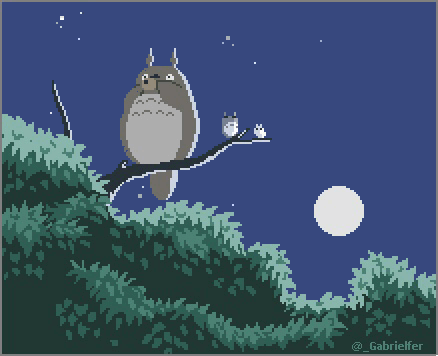

# yo.

  

---

## Tech

---

## About

Curiosity has always driven me to explore how systems and applications work.
I focus on building maintainable, user-friendly software while continuously improving my technical skills.
